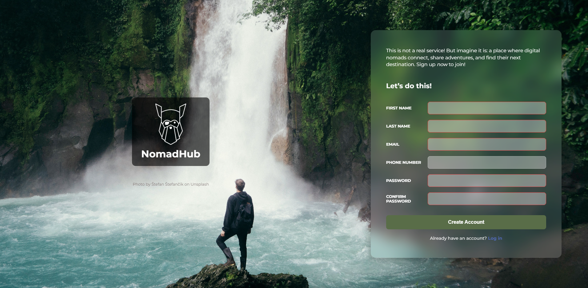

# NomadHub Sign-Up Form

A simple sign-up form project built as part of [The Odin Project](https://www.theodinproject.com/) curriculum.  
The design focuses on **modern UI trends (2025)** such as glassmorphism, clean grid layouts, and interactive hover states.

## About NomadHub (fake business)

**NomadHub** is an imagined platform for digital nomads:  
a place where travelers and remote workers can **connect, share adventures, and discover their next destination**.  

This form represents the entry point into that world — join the community, meet like-minded people, and explore hidden waterfalls, mountain trails, and co-working spaces around the globe. 🌍💻✈️

## Features
- Glassmorphism card design with full background image
- Odin-inspired logo and branding
- Input validation with visual feedback
- Responsive layout (desktop-first)
- Styled button with hover animation (pulse effect)

## Demo
You can view the live project here:  
👉 [NomadHub Sign-Up Form](https://anusirkas.github.io/signup-form/)

## Credits
- Background image: [Štefan Štefančík on Unsplash](https://unsplash.com/photos/euBmypOZUZA)
- Logo: The Odin Project

## Preview
